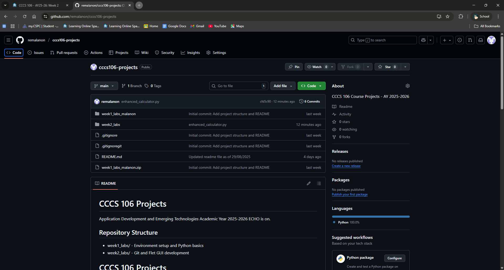

# Lab 2 Report: Git Version Control and Flet GUI Development

**Student Name:** Remar Malanon  
**Student ID:** 231002323  
**Section:** BSCS 3A
**Date:** Sep 2, 2025 

---

## Git Configuration

### Repository Setup
- **GitHub Repository:** [https://github.com/remalanon/cccs106-projects](https://github.com/remalanon/cccs106-projects)  
- **Local Repository:** ✅ Initialized and connected  
- **Commit History:** 13 Total Commit History as of Sep 3, 2025

### Git Skills Demonstrated
- ✅ Repository initialization and configuration  
- ✅ Adding, committing, and pushing changes  
- ✅ Branch creation and merging  
- ✅ Remote repository management  

---

## Flet GUI Applications

### 1. `hello_flet.py`
- **Status:** ✅ Completed  
- **Features:** Interactive greeting, student info display, dialog boxes  
- **UI Components:** Text, TextField, Buttons, Dialog, Containers  
- **Notes:** Learned how to trigger dialog popups based on user input  

### 2. `personal_info_gui.py`
- **Status:** ✅ Completed  
- **Features:** Form inputs, dropdowns, radio buttons, profile generation  
- **UI Components:** TextField, Dropdown, RadioGroup, Containers, Scrolling  
- **Error Handling:** Input validation and user feedback  
- **Notes:** Practiced handling multiple input types and validating them  

### 3. enhanced_calculator.py
- **Status:** ✅ Completed  
- **Features:** Basic and advanced operations (+, -, ×, ÷, %, exponentiation, clear, delete)  
- **UI Components:** Buttons, TextField (for display), Grid layout  
- **Error Handling:** Division by zero handling, input validation, error feedback  
- **Notes:** Improved version of the basic calculator with better UI and functionality  

---

## Technical Skills Developed

### Git Version Control
- Understanding of repository concepts  
- Basic Git workflow (add, commit, push)  
- Branch management and merging  
- Remote repository collaboration  

### Flet GUI Development
- Flet 0.28.3 syntax and components  
- Page configuration and layout management  
- Event handling and user interaction  
- Modern UI design principles  

---

## Challenges and Solutions
One of the main challenges I encountered was using Git through the Command Prompt (CMD). At first, I had difficulty remembering the exact commands for staging, committing, and pushing changes. I also struggled with setting up the remote origin and handling errors when pushing to GitHub.  

**Solution:** I reviewed Git documentation, practiced frequently used commands, and tried repeating the Git workflow until it became more natural. I also learned how to check my repository status and commit history to verify if I had done things correctly. 

---

## Learning Outcomes
Through this lab, I learned not only how to use Git for version control but also how important it is for managing projects effectively. I realized that writing clear commit messages helps keep track of progress and makes collaboration easier.  

I also developed practical skills in GUI development using Flet, such as handling events, validating inputs, and designing clean layouts. By working on the enhanced calculator and personal information GUI, I learned how small improvements in design and error handling can make a big difference in usability.  

I also understood how Git and Flet complement each other—Git helps track and share code changes, while Flet allows me to create interactive applications. This combination gave me more confidence in both collaborative programming and application development.  

---

## Screenshots

### Git Repository
- My Github repository with commit history.
 

- Local git log showing commits  

### GUI Applications
- `hello_flet.py` running with all features  

- `personal_info_gui.py` with filled form and generated profile  

- 'enhanced calculator.py' with a GUI and improved usability.

---

## Future Enhancements
- Add more scientific functions to the calculator (e.g., square root, exponentiation)  
- Implement file saving/loading in personal_info_gui.py  
- Improve overall UI design with more modern layouts and themes  